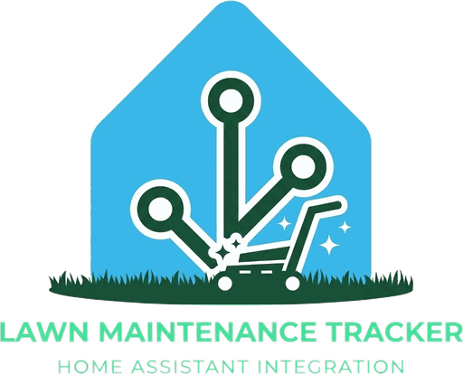

<p align="center">
  <picture>
    <!-- The wordmark is dark green and disappears on a dark ground, so which
         file is the FALLBACK matters: HACS renders this README inside Home
         Assistant's frontend, which is dark by default, and a renderer that
         drops <source> lands on the . The dark-safe variant is therefore
         the img and the light one is the opt-in source, not the other way
         round. The graphic itself is unchanged in both -- only the wordmark
         is lifted. -->
    <source media="(prefers-color-scheme: light)" srcset="brand/logo.png">
    
  </picture>
</p>

# Yard Maintenance

Tracks recurring lawn, turf and plant work against a per-task cadence; keeps a
mow ledger and a blade-wear clock.

Each task has an interval and a last-done date. The integration holds one
table — which jobs are overdue, which are due soon, which have never been
recorded — recomputes it on every write and hourly otherwise, and publishes it
as entities. Logging a job is one action call, so a dashboard button or an
automation can do it.

**Devices supported: none, except optionally a `lawn_mower`.** Everything else
is a date somebody recorded.

## Why a component rather than helpers and templates

This is normally built with `input_datetime` helpers and template sensors.
That works, and hits three walls worth knowing about before you start:

- **A fresh `input_datetime` comes up seeded to TODAY**, so an untouched yard
  asserts that every job has just been done — indistinguishable from a yard
  someone actually maintains. The usual workaround is a one-shot script writing
  a `1970-01-01` sentinel over every date, which destroys real history if it
  ever runs twice. Here a stored `None` is unambiguously "never recorded", and
  no such script exists.
- **YAML cannot create a helper at runtime**, so a plant count has to be a
  compile-time ceiling declared wherever the helpers and the templates each
  live. Here it is one number in the config entry.
- **The task rule ends up a Jinja macro returning a JSON string**, because
  several entities need the same answer and that is the only way to write it
  once. A syntax error then takes every reader unavailable at the same moment.
  Here the rule is `tasks.py`, which imports nothing from `homeassistant` and
  is unit-tested.

## Three states, not two

`unset`, `overdue`, and neither are different facts. A task nobody
has ever recorded is **not** overdue — there is no anchor to be late against —
but it is also not done. Unset rows are surfaced separately in `unset_items`
and never folded into the due count. A rollup that reported them green would
be the silent-empty failure this tracker exists to refuse.

## Entities

One service device, **Yard**. The device name is part of the entity ids: with
`has_entity_name`, Home Assistant slugifies `<device> <entity>`, so "Yard" is
what produces `sensor.yard_maintenance_due_count` and the rest. Renaming the
device silently repoints every one of them, and anything reading the old ids
goes unavailable.

### Read-only

| Entity | What it says |
| --- | --- |
| `sensor.yard_maintenance_due_count` | How many tasks are past cadence. Carries the whole table on its `rows` attribute, plus `overdue_items`, `unset_items`, `due_soon`, `suppressed`, `plants_declared`. |
| `sensor.yard_next_task` | The soonest dated task, with `due_in_days`, `key`, `group`. |
| `sensor.yard_days_since_mow` | Days since the last recorded cut; `unknown` when none. |
| `sensor.yard_blade_hours` | Hours on the current blade. See the limitation below. |
| `sensor.yard_grass_program` | `cool` / `warm` / `unknown`, plus the renovation window and the cadence table. |
| `sensor.yard_mow_sessions` | Sessions this ledger has closed. |
| `binary_sensor.yard_maintenance_overdue` | Anything past cadence. |
| `binary_sensor.yard_blade_due` | Blade at rated life. **Unavailable** while the change date is unrecorded — unset is not `off`. |
| `binary_sensor.yard_renovation_window_open` | Whether today is inside the aeration window. |

### Editable

`datetime.yard_last_*` (one per task), `datetime.yard_blade_changed`,
`datetime.yard_mow_started`, `datetime.yard_plant_N_last_{pruned,treated}`,
`number.yard_*_interval`, `number.yard_lawn_area_sqft`,
`number.yard_blade_{life_hours,minutes}`, `number.yard_last_mow_minutes`,
`select.yard_grass_type`, `select.yard_plant_N_kind`,
`text.yard_plant_N_{name,species,notes}`, `text.yard_last_mow_source`.

**A plant slot is declared by its name and by nothing else.** An empty name
means the slot contributes no rows — not two blank ones.

## Actions

```yaml
# A job just got done
action: yard_maintenance.log_task
data: {key: mow}

# Backdate one
action: yard_maintenance.log_task
data: {key: aeration, when: "2026-09-01 09:00:00"}

# Plant work
action: yard_maintenance.log_plant_task
data: {slot: 1, action: prune}

# A new blade, or a used one with hours already on it
action: yard_maintenance.blade_changed
data: {at_hours: 12}
```

## The mow ledger

If a `lawn_mower` entity is configured, a session opens when it goes to
`mowing` and closes when it returns to `docked` — stamping the mow date,
incrementing the session count, and adding the elapsed minutes to blade wear.

**The interlock is the stored session stamp, not the mower's state**, and that
is deliberate: a lost uplink resolves to `unknown`, and both `idle` and
`charging` resolve to `docked`, so a dock transition alone is not evidence that
grass was cut. A resume from `paused` continues the session it is already in.

Sessions under 2 minutes are discarded as dock excursions rather than cuts;
sessions over 10 hours are capped and logged, because that means a dock event
was missed — the cut is real, its duration is not known.

## Known limitations

- **Blade hours are a floor, not a total.** Segway keeps blade wear in
  the phone app and exposes none of it over the API, so the figure here is
  accumulated only from sessions this integration observed. Any cut it missed
  is missing. `binary_sensor.yard_blade_due` therefore fires **late** rather
  than early, which is the argument for a conservative default life.
- **Plant slots are a fixed count per config entry.** Changing it is an options
  change and a reload, not something that happens at runtime.
- **`Mixed` grass resolves to `unknown`.** A mixed stand has no single
  renovation window, and picking the larger half would be a schedule built on a
  guess.

## Installation

### HACS

1. In Home Assistant: **HACS → ⋮ → Custom repositories**.
2. Add `https://github.com/jrackerby/yard-maintenance` with category **Integration**.
3. Install **Yard Maintenance**, then restart Home Assistant.
4. **Settings → Devices & Services → Add Integration → "Yard Maintenance"**.

### Manual

The integration lives at the repository **root**, not under
`custom_components/` — `hacs.json` declares `content_in_root: true`. To install
by hand, copy this repository's contents into
`config/custom_components/yard_maintenance/` and restart Home Assistant.

Either way a `custom_components/` change needs a **full Home Assistant
restart**; `homeassistant.reload_core_config` does not re-import a custom
component.

Once added, optionally point it at a `lawn_mower` entity.

One instance only. Every entity id here is unprefixed, so a second entry would
take `_2` on all of them and anything already configured would keep reading the
first.

## Removal

Delete the config entry. Its stored document lives at
`.storage/yard_maintenance.state.<entry_id>` and is removed with it.

## Configuration

| Option | Meaning |
| --- | --- |
| Robot mower | Optional. Its sessions stamp the mow date and accumulate blade wear. Leave empty to log every mow by hand. |
| Plant slots | How many plants this yard tracks. Lowering it removes the highest-numbered slots' entities; their stored values are kept. |

## How it updates

There is no service to poll. The table is recomputed on every write, and
otherwise **hourly**, because the only thing that moves on its own is the clock
and the table's finest unit is a whole day.

## Tests

```bash
tools/run_tests.sh
```

43 cases over the pure table, with no Home Assistant present — `tasks.py` and
`const.py` import nothing from `homeassistant`, and the suite loads them by
file path so that stays true.

The table was ported from a Jinja implementation and the port was proved
rather than asserted: both were driven from one scenario set and every field of
every row diffed across 64 comparisons before the old one was deleted. That
caught two real defects — a rounding mode, and an `unknown`-as-plant-name
sentinel — neither of which is findable by reading either implementation
alone.
